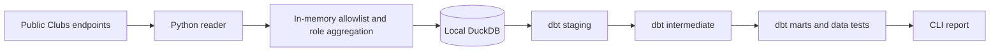

# FC27 Clubs Analytics

An analytics engineering project that captures recent EA Sports FC27 Clubs matches
and turns them into tested performance models with Python, DuckDB, and dbt.

Track results over time, compare playing sessions, and measure contributions by
broad position group. Collection starts with the matches currently visible in the
public Clubs endpoints and builds a local history through repeated reads.

**Status:** the local collector, dbt models, synthetic demo, and CLI reports work.
Live league collection and an overall snapshot have been verified for one target.
A website, automatic scheduling, and advanced event statistics are planned work.
The website UI will omit creator attribution.

No paid service or AI API is required. Run from the project root on Linux/WSL using
Python 3.12 and [uv](https://docs.astral.sh/uv/). This is an independent project,
unaffiliated with EA. The source endpoints are undocumented and may change.

## How it works



| Component | Tools and responsibility |
| --- | --- |
| Collection | Python, uv, Impit; bounded sequential API reads |
| Storage | DuckDB; transactional loading, deduplication, and correction handling |
| Analytics | dbt Core and dbt-duckdb; staging, intermediate, facts, and marts |
| Quality | pytest, dbt data tests, Ruff, SQLFluff, and public-file checks |
| Reporting | Local CLI reading dbt marts; website planned |

The collector stores source observations; dbt owns metric definitions. Repeated
reads update existing club-match observations and preserve first/last-seen times.
Club labels are stored as Club A and Club B, and player statistics are aggregated
by role before any data is written.

## Try the synthetic demo

```bash
git clone https://github.com/jinsoowhang/fc-clubs.git
cd fc-clubs
uv sync --locked --all-groups
uv run fc-clubs demo
uv run fc-clubs build --database data/demo.duckdb
uv run fc-clubs report --database data/demo.duckdb
```

The invented demo contains a win, a draw, and an awarded DNF win for each alias. It
should report three captured matches, two completed matches, and a completed win
rate of 0.5. Repeating demo loading replaces the same matches rather than duplicating
them. Snapshots and collection checks remain append-only.

The demo and automated tests use invented data and need no EA account or live API
access. Demo output is separate from the live warehouse.

## Collect live matches

Supply target names through your current process environment; do not commit a name
mapping, put names in examples, or provide EA account credentials. Configure:

| Environment variable | Meaning |
| --- | --- |
| `FC_CLUB_A_NAME` | Exact in-game name for Club A; omit to skip this club |
| `FC_CLUB_B_NAME` | Exact in-game name for Club B; omit to skip this club |
| `FC_CLUB_A_POOL` | `common-gen5` (default) or `nx` |
| `FC_CLUB_B_POOL` | `common-gen5` (default) or `nx` |

Set the variables in your shell before running the commands. For example, replace
the placeholder with an exact club name:

```bash
export FC_CLUB_A_NAME='YOUR EXACT CLUB NAME'
```

`common-gen5` covers the PS5/Xbox Series/PC group. `nx` is the Nintendo pool.
Additional targets can be configured through the Club B variables above.

Then run:

```bash
uv run fc-clubs discover
uv run fc-clubs collect
uv run fc-clubs build
uv run fc-clubs report
```

Discovery requires one exact, case-insensitive name match. A similarly named club
is never selected automatically. Collection uses all three scopes by default:
`leagueMatch`, `playoffMatch`, `friendlyMatch`. Use `--scope leagueMatch` for a narrower
read. A failing club or scope leaves prior captures intact, records availability,
continues to other configured targets, and returns a nonzero exit status.

The reader uses Impit's Chrome network profile, following the approach documented
by [a maintained Clubs client](https://github.com/alex-jordan547/proclubs-sdk).
Requests are sequential, with a one-second minimum interval, a ten-second timeout,
and a streamed five-megabyte response limit. TLS verification is enabled; redirects
are disabled. Each request uses a fresh client without EA account cookies. Failed
requests are not automatically retried.

`http_403` means the request was rejected. `club_not_found` means a valid search
response contained no exact name match. Check the exact in-game name and platform
pool for the latter. These failures never become successful empty match captures.

Live and demo databases are separate and cannot be mixed. No background scheduler
is installed. Run collection during play and again after matches appear; the local
computer must stay awake. The source only exposes a rolling recent window, reported
by community clients as at most ten matches per category, with no historical paging.
Capture starts with currently visible matches. No complete season history is promised.

## Analytical outputs

dbt uses `models/staging`, `models/intermediate`, and `models/marts`. Its default
schema names are `analytics_staging`, `analytics_intermediate`, and `analytics_marts`.

- `fct_club_matches`: captured results, DNF flags, anonymous technical match keys.
- `fct_club_role_matches`: anonymous role counts, ratings, passing/tackling measures.
- `fct_club_sessions`: sessions inferred from gaps greater than 90 minutes per club/scope.
- `fct_club_snapshots`: reported overall totals, separate from captured-match statistics.
- `mart_club_performance`: results across captured history, split by scope.
- `mart_club_daily_performance`: UTC-date trends.
- `mart_role_performance`: contributions and weighted accuracy by broad role.
- `mart_collection_coverage`: latest collection status and possible window overflow.

The CLI report is for local review, not an automatic public export. A future website
will consume dbt results. Source details, model grains, metric rules, and limitations
are in [the contract](notes/Data%20Contract.md).

Key metric choices:

- Completed-match win rate excludes DNF matches and unknown outcomes.
- Passing and tackling accuracy use summed completions divided by summed attempts.
- Missing measures remain unknown; they are not converted to zero.
- Sessions are inferred using a 90-minute gap within each club and match scope.
- Every report describes captured matches, with collection coverage shown separately.

## Repository layout

```text
src/fc_clubs/          API reader, sanitizer, storage, CLI, and dbt build wrapper
models/staging/       Typed source projections
models/intermediate/  Session grouping
models/marts/         Facts, dimensions, and reporting metrics
macros/               Shared SQL and grain checks
tests/python/         Synthetic pipeline, privacy, transport, and metric tests
tests/dbt/            Analytical invariants and reconciliation
scripts/              Local verification and public-file checks
notes/                Research, plan, contracts, and session notes
```

## Privacy and verification

Player names, gamertags, account IDs, source club names/IDs, and opponent identities
are never written by the collector. It persists only allowlisted measures, timestamps,
generic aliases, and salted match keys. A random project-specific salt lives in the
ignored local database; player identities are neither hashed nor pseudonymized.
Full responses and raw exception diagnostics are not saved. dbt builds in disposable
generic temporary paths so its generated manifests/logs do not remain in the project.

Local dates, scores, small role groups, and matches can still enable indirect linkage.
Review/coarsen them before publishing. Creator privacy applies to the eventual
website UI: omit personal names, handles, email addresses, profile links, and
creator credits. GitHub account ownership and commit attribution are acceptable.

```bash
bash scripts/check.sh
```

Checks include Python lint/formatting, privacy and transaction tests, complete dbt
builds on invented data, metric/session reconciliation, SQL lint, and public-file
checks. They need no EA credentials, live access, or real source data.

The latest full verification passed 37 Python tests. A complete dbt build creates
14 models and runs 21 data tests. The same synthetic demo was reproduced from a
clean source copy with locked dependencies.

Runtime databases, local environments, caches, secrets, and generated dbt outputs
are excluded through `.gitignore` and are not part of the public repository.

## Scope and next steps

The collector reads `leagueMatch`, `playoffMatch`, and `friendlyMatch`. Public data
access for other Grounds activities has not been established.

- Build a website consuming reviewed dbt results.
- Choose a collection schedule based on playing frequency and observed publication lag.
- Validate advanced event counters before adding them to metrics.

See the [project plan](notes/Project%20Plan.md),
[data contract](notes/Data%20Contract.md), and
[source research](notes/FC27%20Data%20Research%20and%20Project%20Options.md).
